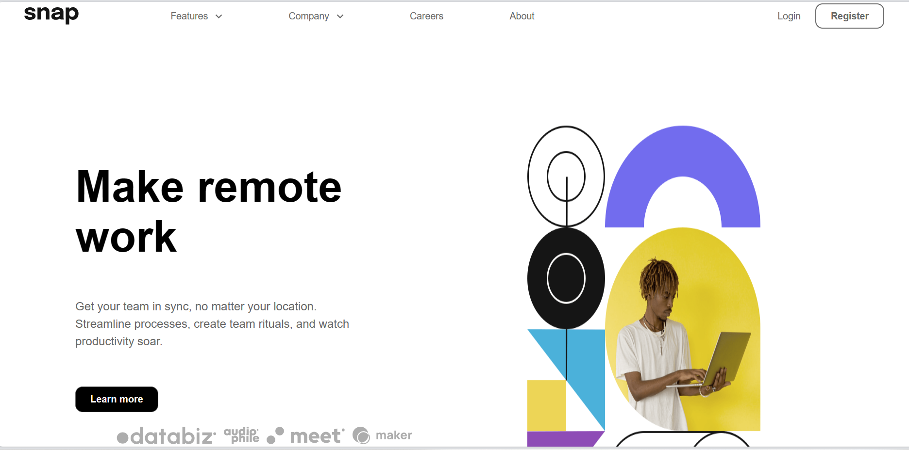

# Frontend Mentor - Intro section with dropdown navigation solution

## Table of contents

- [Overview](#overview)
  - [Screenshot](#screenshot)
  - [Links](#links)
- [My process](#my-process)
  - [Built with](#built-with)
  - [What I learned](#what-i-learned)
  - [Continued development](#continued-development)
  - [Useful resources](#useful-resources)
- [Author](#author)
- [Acknowledgments](#acknowledgments)

## Overview

### Desktop Screenshot

### Links

- Solution URL: [Add solution URL here](https://your-solution-url.com)
- Live Site URL: [Add live site URL here](https://your-live-site-url.com)

## My process

### Built with

- React JS Framework
- CSS custom properties
- Flexbox
- CSS Grid
- Desktop-first workflow
- [React](https://reactjs.org/) - JS library

### What I learned
I learnt some very useful skills, like how to create the hamburger and close menu icon with the `span` element. And how to use CSS to style them. This is my second time trying this challenge. I quitted on the first one because I was just learning React and didnt know how to go about things in my project. 

I also learnt some useful techniques like changing the navigation bar for a list of links to the hamburger without needing to manually change the DOM itself. Although I didn't use Vanilla JS so I couldn't use that concept, but if I were to do this with Vanilla JS that is how I would have gone about this challenge.

### Continued development
To improve on my styling, Layout(Grid and Flexbox styling), and most importantly using React and other Frameworks to become a better developer.

### Useful resources

- [PedroTech on Youtube](https://www.example.com) - This helped me for XYZ reason. I really liked this pattern and will use it going forward. It really made some thing easier like creating one function and using it everywhere by creating a Custom Hook.

- [PedroTech on Youtube](https://www.example.com) - This helped me for XYZ reason. I really liked this pattern and will use it going forward. It really made some thing easier like creating one function and using it everywhere by creating a Custom Hook.

- [Supersimple Dev on Youtube](https://www.youtube.com/c/supersimpledev) - Helped me a lot from the beginning of my programming journey from HTML, CSS to JavaScript. In my opinion, he's the best Web Dev Teacher on Youtube. His patience and concise way of explaining concepts are the best

## Author

<!-- - Website - [Add your name here](https://www.your-site.com) -->
- Frontend Mentor - [@AshongAbdallah06](https://www.frontendmentor.io/profile/AshongAbdallah06)
- Twitter - [@XuGaR_2_0_0_6](https://twitter.com/XuGaR_2_0_0_6)

## Acknowledgments
Check the tags on - [Useful resources](#useful-resources) above

They didn't particularly help me with the project, but it helped me understood some concepts and how to approach the challenge
